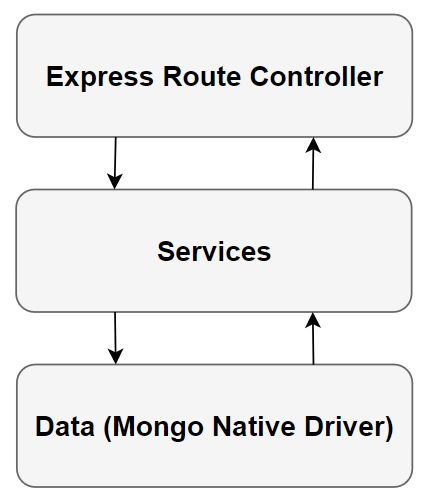
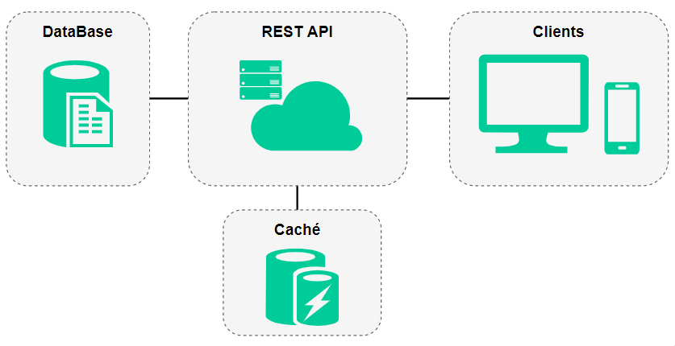

# Trips API

Trips API developed with Express/NodeJs to CRUD Trips from different cities.


### 🚀 Links

 * **Live API:** https://trips-api.now.sh/api/


### 🛠️ Installation

Require Node.JS
```
npm install
```

Create a **.env** file at root level following the example file (.env-example).
```
//CONFIG
CORS=*
PORT=3002
NODE_ENV=development
//MONGO
DB_USER=XXX
DB_PASSWORD=XXX
DB_HOST=XXX
DB_NAME=XXX
```

### 🖥 Execution

📌**Development Environment**
```
* `npm run dev` For developing environment.
* `npm run dev:windows` For developing environment on windows.
```

>This project runs on **http://localhost:3002** or the specified **PORT** on the .env file.

📌**Production Environment**

Run the following command to run the production build:
```
* `npm run start` For production environment.
* `npm run start:windows` For production environment on windows.
```

📌**Deployment on Vercel/Now**

Run the following command to create the production build and deploy on Vercel/Now:
```
now
```

### 🧱 Architecture

📌**Three Layer architecture**

I use a three-tier architecture to divide responsibilities and keep logic, services, and data independent of each other.



### 🔨 Architecture




### 🧰 GitFlow

For the GitFlow every feature was developed over a specific branch and after being completed, it should be merged to the Development Branch. For every deploy the Development branch is merged to Master Branch.


### 💻 Technologies

  * NodeJs
  * Express
  * MongoDB
  * Swagger
  * Hapi Joi & Boom
  * ESLint


### ✒️ Author

* **William Velazquez** - [WilliamVelazquez](https://github.com/WilliamVelazquez)

If you want to know about the insights [click here!](https://github.com/WilliamVelazquez/terapify-api/pulse/monthly)

### 🎁 Contribute

Feel free to contribute to the project!